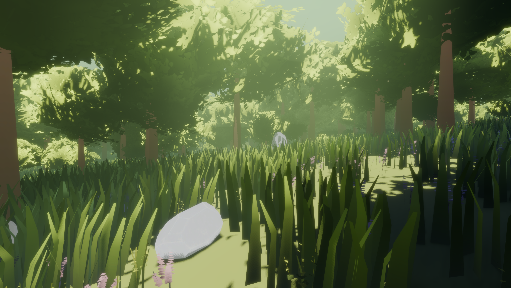
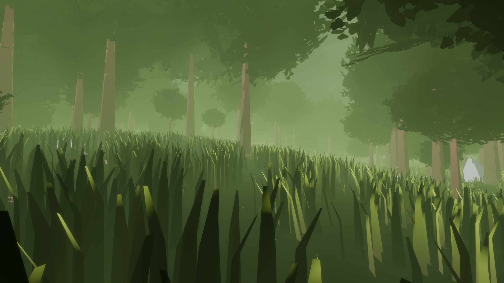
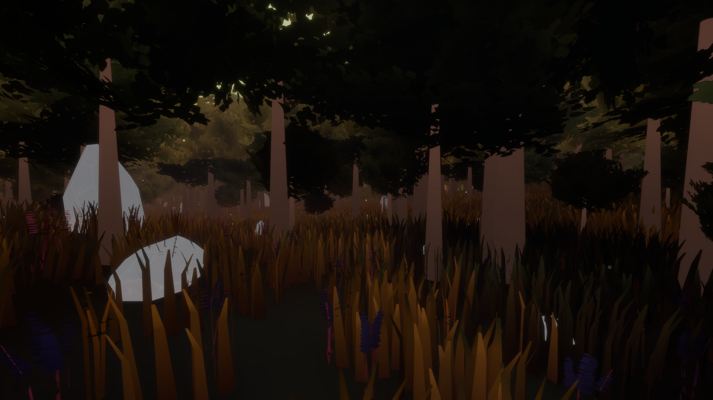

# Godot Stylized Forest

A Zelda inspired stylized forest using toon shaders and global illumination!

Was messing around with TerraBrush and wanted to make a cool forest scene with it.

https://github.com/spimort/TerraBrush

Was also good practice making stylized assets and shaders in Blender.

Free to download and explore. Have fun!

# Screenshots

Created by Jonnie Gieringer
